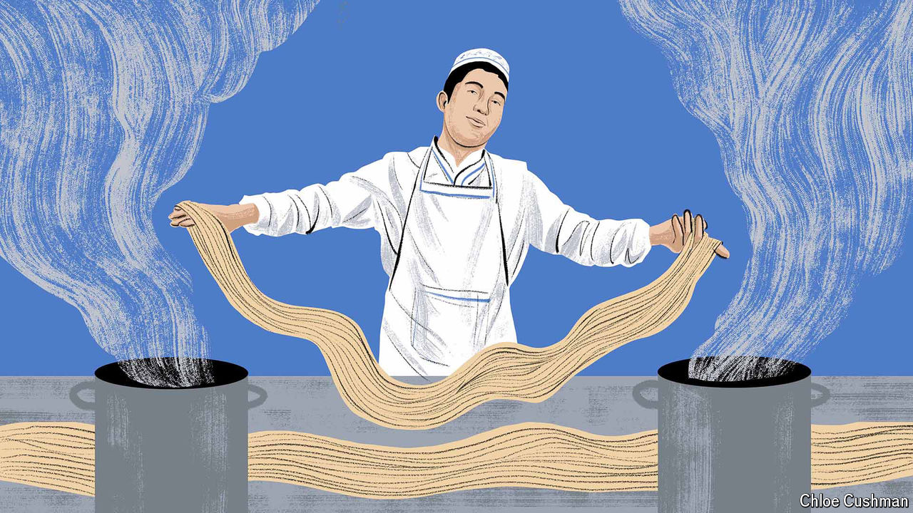

###### Chaguan

# In today’s China, to get rich is perilous 

##### Business sectors can be praised one day and banned the next 

 

> May 9th 2024 

SINCE CHINA re-embraced capitalism decades ago, rich rewards have flowed to entrepreneurs who understand what the Communist Party wants. Today grasping what the party dislikes may be a more precious skill. This is an era when leaders’ priorities can change overnight. When the winds turn, entrepreneurs need to curb their ambitions without complaint.

Ningxia, a poor western region, is a good place to observe this trend. A decade ago Ningxia’s government announced plans to “go global” and “seize the commanding heights” of domestic and foreign markets for meat and dairy products that are halal, or in line with Islamic food laws. As dreams go, this was not especially fantastical. Though much of Ningxia is arid grasslands, the region is home to big dairy companies and sheep and cattle producers. Just over a third of its 7.3m-strong population are Hui Muslims, Chinese-speaking descendants of long-ago migrants from Arabia, Persia and Central Asia. Many local Hui shun pork and alcohol and eat products approved by the region’s religious-affairs bureau as . The term is Chinese for “pure and true” and can mean both halal and Islamic (mosques are known as temples).

