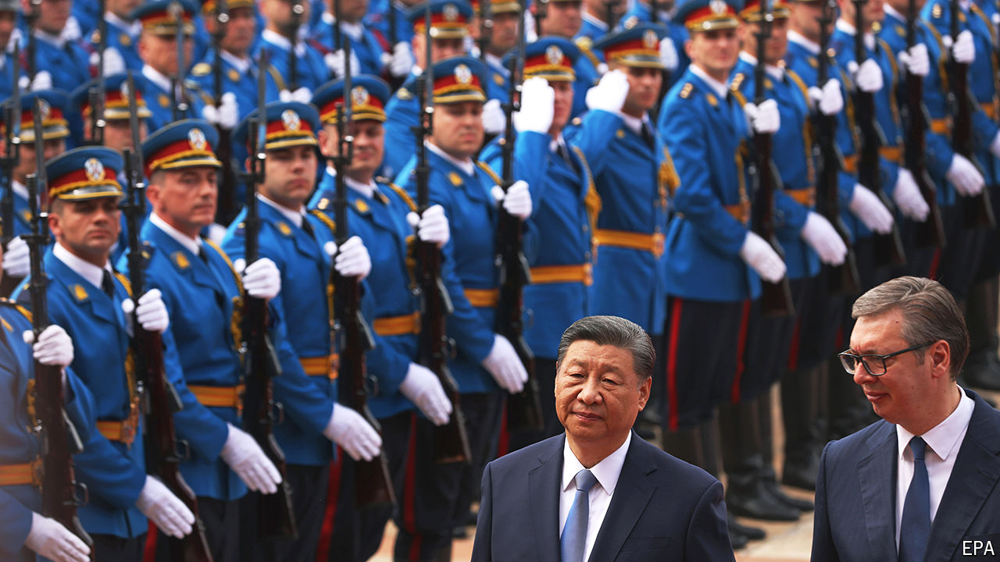

###### Stirring ghosts

# Visiting Europe, Xi Jinping brings up an old grievance 

##### In marking the bombing of China’s embassy in Belgrade, Mr Xi is sending a message to America 

 

> May 6th 2024 

THE POPULATION of Serbia is less than one-third of Beijing’s. China’s trade with the Balkan country is less than one-fortieth of that with Germany. Yet for China’s ruler, Xi Jinping, . It is a rare close friend on a continent where wariness of China has become the norm. And the country’s capital, Belgrade, witnessed a seminal moment in the evolution of Chinese nationalism. Twenty-five years ago American bombs hit the Chinese embassy there, killing three people. On his first visit to Europe since 2019 Mr Xi held talks with Emmanuel Macron, the president of France, hoping to persuade him and his allies that China and its products are good for them. Then, in Serbia, Mr Xi used the anniversary of the bombing to make a thinly veiled point: that the Western-led order is bad and must be changed.

The world has changed dramatically since Mr Xi’s previous visit to Europe. A pandemic has swept it, keeping Mr Xi from venturing abroad for nearly three years. Russia—China’s —has mounted an invasion of Ukraine, plunging Europe into its biggest security crisis since the cold war. Under President Joe Biden, America has ramped up a tech war with China aimed at curtailing its access to cutting-edge kit. The European Union now talks of “” its relationship with China. Amid accusations that China is dumping products on Western markets, calls for retaliation have been growing. 

