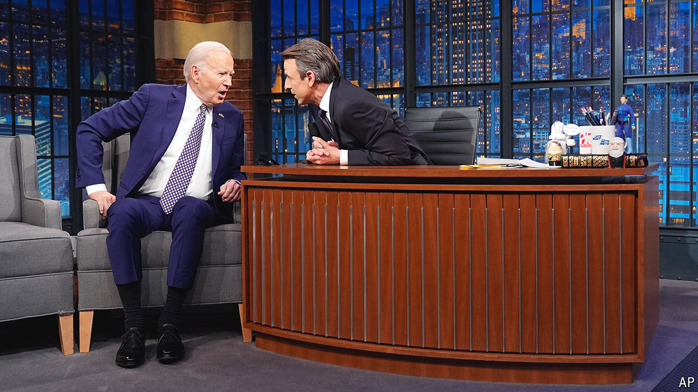

###### No laughing matter

# American comedy has become too safe on TV 

##### The internet hosts livelier acts 

 

> May 9th 2024 

At the annual White House correspondents’ dinner comedians sing for their supper—and usually serve up a roast for dessert. Not this year. On April 27th Colin Jost, a host of “Saturday Night Live”, delivered a meek stand-up routine with some perfunctory barbs about the media and political elites, before thanking President Joe Biden for being “a decent man”. 

This year ought to offer plenty of material to spin into laughs. The leading candidates for the  are maladroit, elderly men prone to gaffes. But many of comedy’s most recognisable names are not taking advantage of the material, at least on TV.

