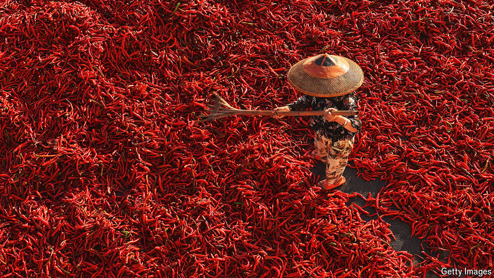

###### World in a dish

# How the chilli pepper has set fire to the internet in China 

##### Thanks to Mao, the once-derided pepper quietly revolutionised Chinese palates 

 

> May 8th 2024 

Tianshui, a city tucked away in China’s north-western hills, does not normally make headline news. But a fiery soup that owes its unique flavour to locally grown Gangu  has lit up the internet. Since March, the hashtag #TianshuiMalatang, referring to a popular type of street food, has racked up more than 140m views on Weibo, a social-media platform. Millions have flocked to the city to try it themselves. A local chef was caught on tape looking so miserable at work that local authorities had to give him a talking-to so that he remembered to smile.

Increasingly the Chinese palate is craving spice. Last year Meituan, China’s biggest food-delivery app, reported that nearly 80% of restaurants now offer spicy fare, a taste known as  in Chinese. Look back a few hundred years, though, and chillies were nowhere to be found.

