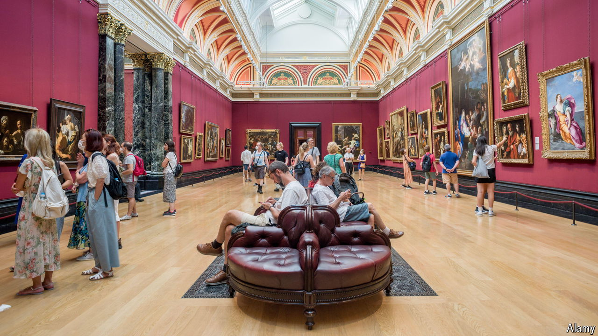

###### Playing to the gallery

# In its 200 years the National Gallery has mirrored Britain 

##### When Old Masters meet TikTok 

 

> May 9th 2024 

SOMETIMES A LITTLE geopolitical rivalry can produce a big pay-off. France opened the Louvre in 1793. The Netherlands followed with what is now known as the Rijksmuseum, then Spain with the Prado. Britain had flirted with the idea of a national collection of art since the 1770s but did not make a move until 1824.

Unlike in France and Spain, the British royal family would not hand over its beloved paintings. So the government decided to purchase 38, many of them , from John Julius Angerstein, an insurance broker, for £57,000 (roughly $6.5m in today’s money). As one MP proclaimed, Britain had finally been rescued “from a disgrace which the want of such an establishment had long entailed upon it”. 

