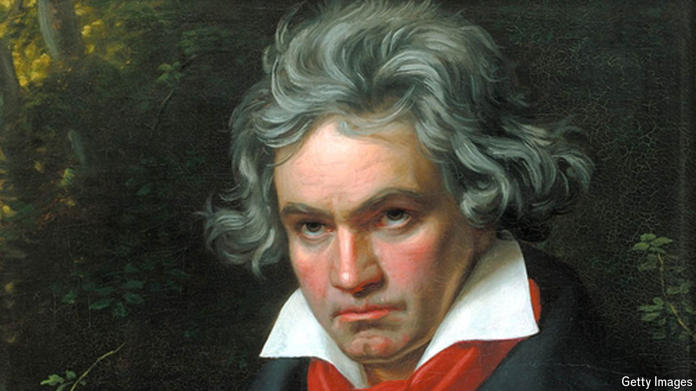

###### Something for everyone

# Why Beethoven’s ninth appeals to democrats and despots alike 

##### Since its first performance 200 years ago, few pieces of music have won such varied devotees 

 

> May 7th 2024 

Ludwig van Beethoven’s ninth and final symphony was first performed on May 7th 1824 at Kärntnertor Theatre in Vienna. By then deaf,  took to the stage for the first time in 12 years to help conduct it, to a thunderous ovation. Since then, the roughly 70-minute symphony—and in particular its triumphant choral finale, “Ode to Joy”—has been admired by all kinds of audiences: left and right, democrats and totalitarians, capitalists and communists. 

In Nazi Germany, “Ode to Joy” was trotted out each year to celebrate Adolf Hitler’s birthday. Josef Stalin ordered it played in every Soviet village. The symphony was performed for the tenth anniversary of ’s victory in the Chinese civil war in 1949, and in 1974 the white-supremacist regime of Rhodesia made “Ode to Joy” its anthem.

