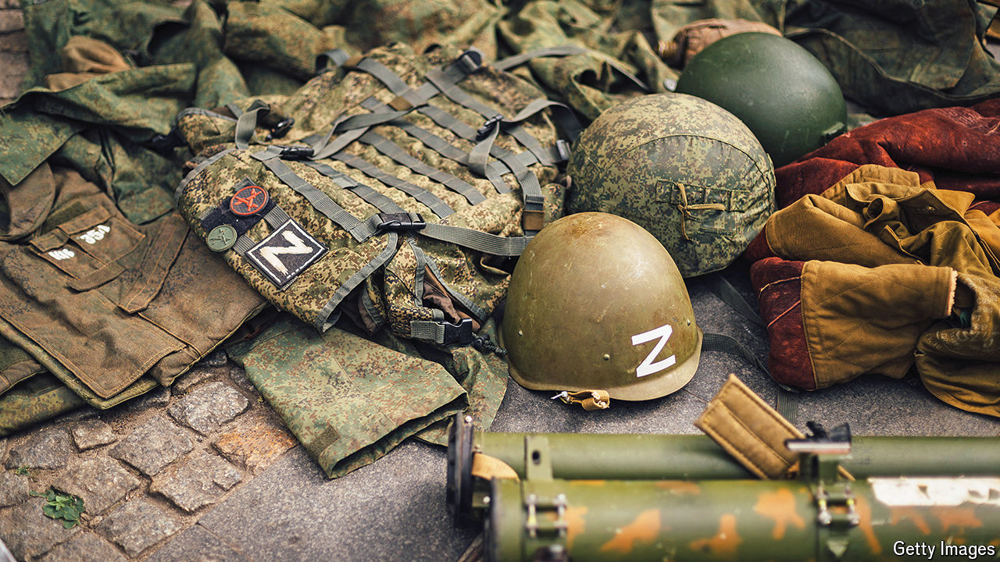

###### The shrapnel dealers

# Dealers are selling war trophies to buy weapons for Ukraine 

##### A sometimes gruesome trade helps defenders on the front lines 

 

> May 9th 2024 

Strange packages often arrive at Greg’s flat in Zaporizhia, in south-eastern Ukraine. Sometimes they contain military jackets, helmets and backpacks. But armoured plates and fragments of destroyed rockets are also common. These war trophies are sent to him by Ukrainian soldiers on the front line, so he can sell them online. Sometimes the goods are too gory to trade. “I had a helmet with parts of brain attached,” says Greg, who like other dealers did not want his full name used. 

War trophies have been traded since ancient times. Since Russia’s full-scale invasion of Ukraine two years ago, the trade has moved online. Russian helmets, some with their owner’s name inscribed, can fetch more than $1,400 on eBay. Other items range from Spetsnaz uniforms to bits of downed Sukhoi fighter jets. Some sellers turn military wreckage into key chains that sell for $200. Items can move from corpse to buyer in days. Dealers argue the trade keeps Westerners interested in the war. “It’s marketing,” reckons a seller. 

