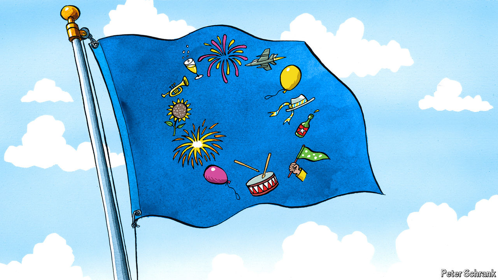

###### Charlemagne

# National days offer a study into the inner psyche of Europeans 

##### Happy Europe Day! 

 

> May 9th 2024 

Want to get anything done in Europe? Avoid May. The month kicks off with Workers’ Day, which is celebrated by not working. The end of the second world war on the continent (May 8th) warrants another day off in some places. The Christian festivals of Orthodox Easter, Ascension and Pentecost result in yet more long weekends. All this time off can have a paradoxical effect. Reportedly, the French government had planned a big conference this week on promoting the four-day work week—but then realised Wednesday and Thursday were , days off which most people supplement with a (bridge) on Friday. The confab was postponed. Only in Europe would it be a struggle to get people to attend a meeting on working less.

Another reason to spend time away from the office this past week was Europe Day on May 9th. The occasion is the anniversary of the plan put forward in 1950 to pool the continent’s coal and steel industries which, several million meetings later, gave birth to today’s European Union. Alas, the holiday is not for the public to enjoy, but only for the 60,000-plus employees of the bloc’s institutions, most of them based in Brussels. Perhaps one day, a few million meetings hence, citizens from across a federalised union will mark the holiday together. For now the EU’s 27 members (and a dozen neighbours not in the club) jealously guard “their” national days. The occasions they choose to celebrate—revolution in France, the death of a poet in Portugal, neutrality in Austria—and the manner in which the days are spent offer a glimpse into the psyches of the continent’s citizens.

