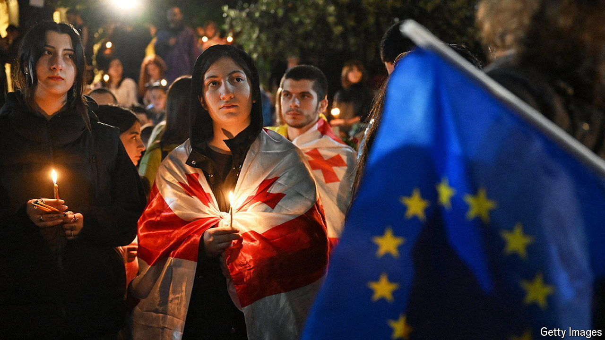

###### Dream a little dream of EU

# Protests against a Russian-style law threaten Georgia’s government 

##### The country’s behind-the-scenes ruler may want to scotch its EU candidacy 

 

> May 9th 2024 

Bidzina Ivanishvili, the Georgian oligarch who dominates the country’s politics from behind the scenes, emerged on April 29th for a rare public appearance. It was an ominous one. He accused the West of using Georgian NGOs and opposition parties to organise a “revolution” against his party, and promised retribution after elections this autumn. Anti-government protests, meanwhile, have been growing. After police used tear gas to break up demonstrations, shops in Tbilisi quickly sold out of gas masks and goggles as protesters girded for more. 

The most serious political crisis in the 12-year rule of the Georgian Dream party is entirely of its own making. It was prompted by the party’s unexpected reintroduction in early April of a “foreign agent” law that would require NGOs and media outlets which get more than 20% of their funding from abroad to enter themselves into a public registry. The party tried to pass the same law in 2023. Then, too, it spurred huge protests and sharp warnings from Georgia’s American and European partners. The law looks like an imitation of similar measures in Russia, which has used the “foreign agent” label to silence critical voices. The resistance drove Georgian Dream to withdraw the bill.

