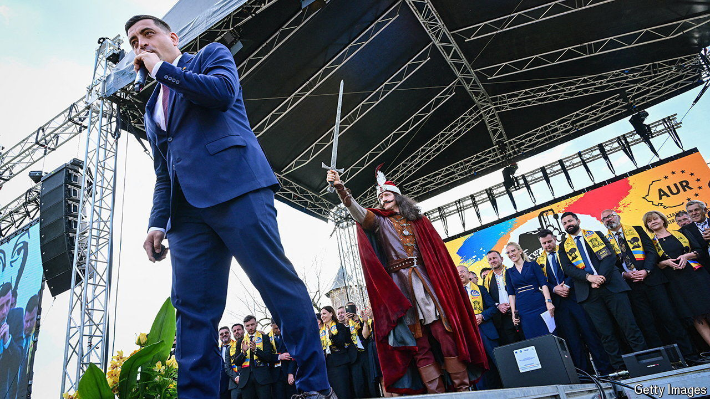

###### Fans of the other Vlad

# Romania’s hard right looks strong in a year of four elections 

##### The AUR party of George Simion is expecting its best result yet 

 

> May 9th 2024 

It is not clear that most populist nationalists think Europe was ever great. But “Make Europe Great Again” was the slogan on the baseball caps at an international hard-right conference in Bucharest at the end of April sponsored by the Alliance for the Unity of Romanians (AUR), the country’s nationalist anti-immigration party. Speakers denounced the “invasion” of Europe by Muslims, and of America by illegal migrants. There was lusty applause when Donald Trump’s name was mentioned, and when speakers denounced gay and trans “ideology” and the “godless” bureaucrats of Brussels. 

For AUR the powwow, held in the vast halls of the parliament building, was less about forging international unity than domestic campaigning. Romania is holding four sets of elections this year. The party is adept at publicity: its TikTok videos are slick; its giant election posters feature Vlad Dracula, the Romanian hero and medieval prince also known as Vlad the Impaler. The results of the elections will “set the political agenda for the next ten years”, says Remus Stefureac, the head of Inscop Research, a polling firm. On June 9th Romanians vote in European and local elections. Later in the year they will vote in presidential and parliamentary ones. 

