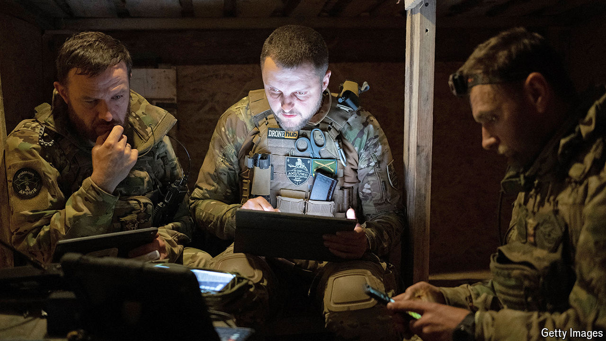

###### Holding Europe’s line

# Ukraine’s defenders anxiously dig in for a looming Russian assault 

##### The West’s delays on weapons help Vladimir Putin exploit superior numbers 

 

> May 9th 2024 

BATHED IN afternoon sun and the scent of lilac, the hamlet near Kostiantynivka, a small town in Ukraine’s Donbas region, could be a picture of bucolic peace. But the sounds of birds and lawnmowers are interrupted by the constant boom of artillery less than 10km away. The few remaining villagers go about their lives, paying little attention to the pickup truck parked outside a small brick cottage. At first glance the cottage seems little different from the village’s other houses, with their little vegetable plots round the back. 

But walk inside and you find yourself in the headquarters of the air-defence battalion of Ukraine’s legendary 92nd assault brigade. It is currently fighting in Chasiv Yar, the most intense part of the Donbas front. Behind the house, steps lead down through a trench and into a large van, dug into the ground and covered in camouflage. Inside this command centre, officers monitor two screens. One shows radar images of the skies above the front line and some 50km into Russian-held territory. The other shows a half-dozen live feeds from Ukrainian reconnaissance drones. 

