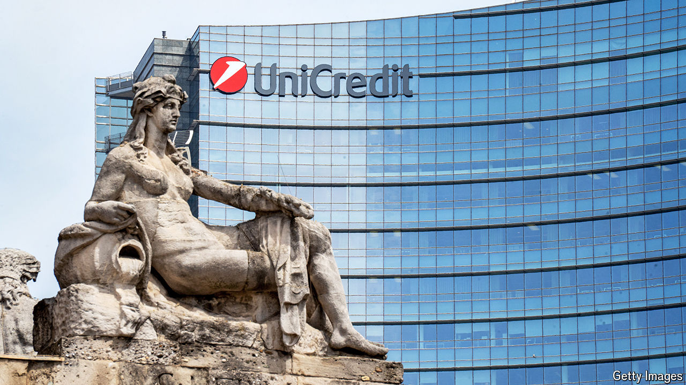
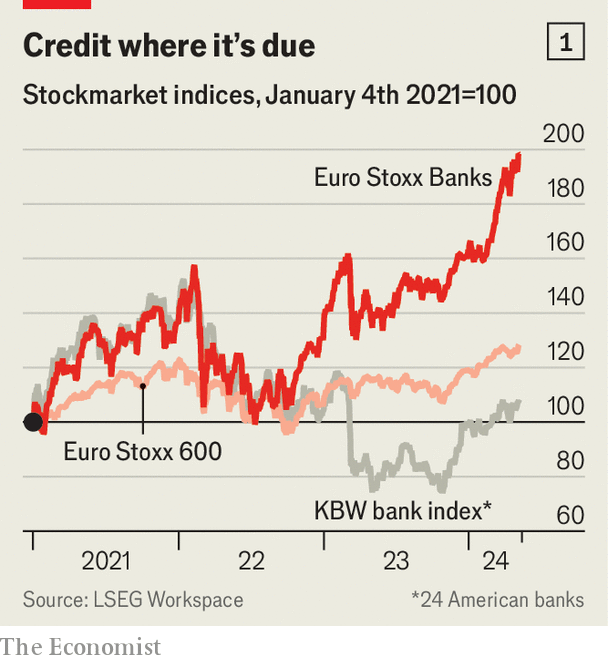

###### Bona fide

# Against expectations, European banks are thriving 

##### Many are now ripe for a takeover 

 

> May 9th 2024 

In 2020, when BBVA and Sabadell abandoned merger discussions, it was difficult to find investors with anything positive to say about European banks. A decade of near-zero interest rates, stiff regulation and anaemic economic growth had made them unprofitable and unattractive. The two Spanish lenders were no exception. BBVA had a market value of €26bn ($32bn), less than 40% of its 2007 peak. At €2bn, Sabadell was worth only a fifth of the accounting (“book”) value of its equity.

 


