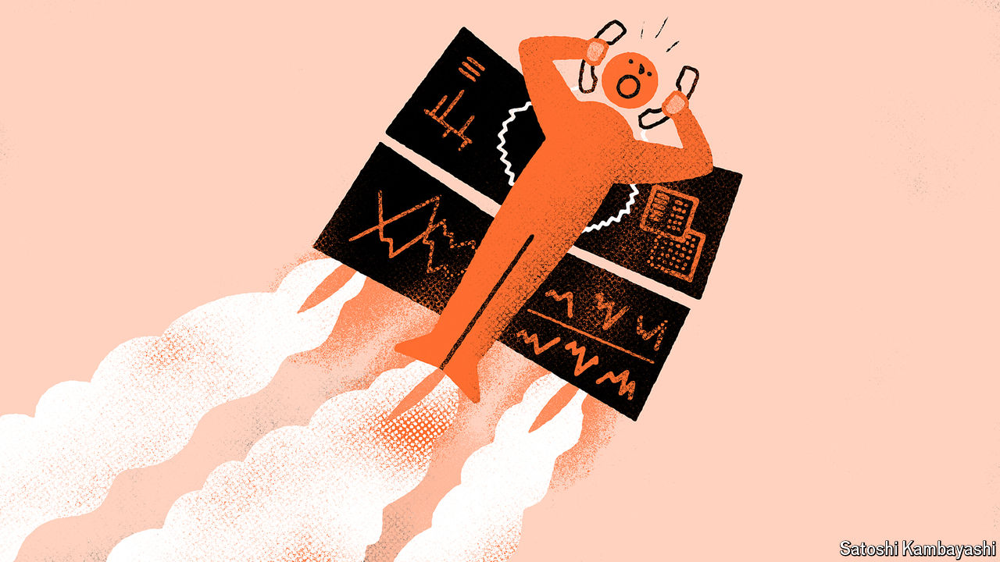

###### Buttonwood

# Banks, at least, are making money from a turbulent world 

##### It is once again a good time to work on a trading desk 

 

> May 9th 2024 

Working on a trading desk is perhaps the closest an office job can get to a sport. Focus and reflexes matter. On the other side of every trill of the phone or ding from a computer is a client who wants to trade. If ignored, they will hang up and call a competitor. Everyone is sweating, owing to the heat wafting up from stacks of computers whirring at capacity. On a busy day, it is impossible to leave the desk—making the job a feat of endurance. Just as sports teams use code to communicate their tactics, so do traders: “cable, a yard, mine, Geneva,” translates to “Brevan Howard, a hedge fund, is buying £1bn and selling dollars.” Mistakes cause swearing, shouting and sometimes the smashing of equipment.

Or at least that is how it was a couple of decades ago, in the good old days. Following the global financial crisis of 2007-09, life sapped from the trading floor. Stringent new rules curbed profits. High-frequency traders ate banks’ lunches, especially in stockmarkets. For its part, the global economy was in a stupor, having been tranquillised by low interest rates. Markets moved linearly, with equities drifting up and bond yields slipping down. There were fireworks—the Brexit vote or the election of Donald Trump—but they were rare. This placid world provided investors with little reason to trade in and out of positions. Revenues were slim; returns sagged. Drama on trading floors featured lay-offs, rather than market moves.

