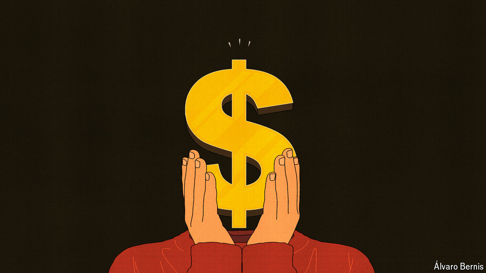

###### Free exchange

# Could America and its allies club together to weaken the dollar? 

##### China would not be happy 

 

> May 9th 2024 

The Plaza Hotel has New York glamour in spades. Sitting at a corner of Central Park, it was the setting for “Home Alone 2”, a film that came out in 1992 in which a child finds himself lost in the metropolis. He takes up residence in one of the hotel’s suites, thanks to his father’s credit card, and briefly lives a life of luxury. Donald Trump, the hotel’s owner at the time, has a walk-on part, which was the outcome of a hard bargain. According to the film’s director, he demanded to appear as a condition for giving the filmmakers access to the hotel. This was not the first deal in which the venue had played a part. Seven years earlier it hosted negotiators for the Plaza Accord, which was agreed on by America, Britain, France, Japan and West Germany, and aimed for a depreciation of the dollar against the yen and the Deutschmark. 

Echoes of the period can be heard today. In the mid-1980s America was booming. Ronald Reagan’s tax cuts had led to a wide fiscal deficit and the Federal Reserve had raised interest rates to bring inflation to heel. As a consequence, the dollar soared. American policymakers worried about a loss of competitiveness to an up-and-coming Asian economy (Japan then, China today). The Plaza Accord was designed to address what officials saw as the persistent mispricing of the dollar. Robert Lighthizer, Mr Trump’s trade adviser, has mulled a repeat. The accord set a precedent for “significant negotiation between America’s allies to address unfair global practices”, he wrote in “No Trade is Free”, a book published last year. Mr Trump’s team is reportedly considering options to devalue the dollar if the former president returns to office. 

