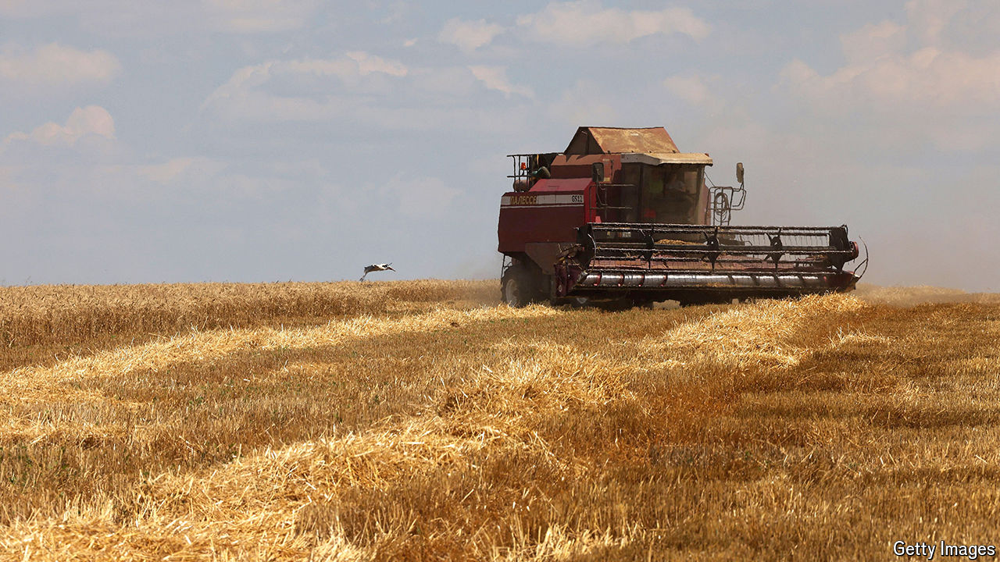

###### Funding the fight

# How Ukrainian farmers are using the cover of war to escape taxes 

##### “Black grain” infuriates exporters playing by the rules 

 

> May 7th 2024 

Since Russia began its invasion in 2022, Ukraine’s economy has shrunk by a quarter. But the ravages of war are not the only reason for the government’s reduced tax take. Businesses are also making use of the chaos to dodge paying their fair share. This is particularly true in agriculture, which before the war was responsible for 40% or so of Ukraine’s exports by income. The sector has been transformed by a scramble to find export routes safe from Russian attack. As Taras Kachka, Ukraine’s deputy minister for agriculture, notes, this disturbance has provided plenty of opportunity for farmers to “optimise taxes”.

Around 6.5m Ukrainians—or 15% of the country’s pre-war population—have escaped the country, shrinking the domestic food market. At the same time, Russia is targeting transport infrastructure, grain silos and other agricultural equipment, which has driven up costs. Many workers have been recruited by the armed forces, and are at the front. “If you can drive a tractor, you can drive a tank,” notes Mr Kachka. Farmers therefore not only have new opportunities to evade taxes, they are also increasingly desperate. The result is that two of every five tonnes of grain harvests now avoid contributing to state coffers, according to Mr Kachka’s estimates.

