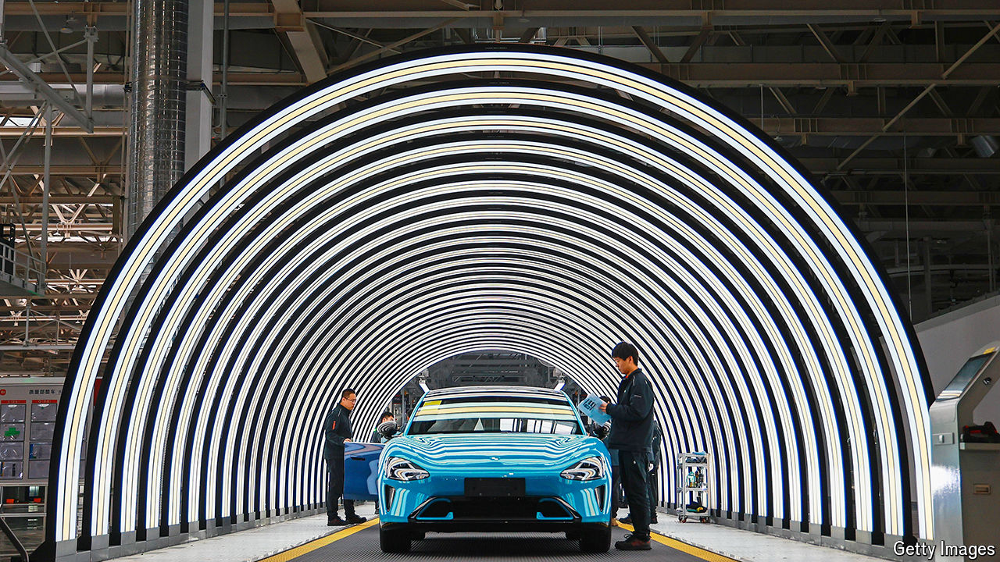

###### Electric cars and more

# What Xi Jinping gets wrong about China’s economy 

##### Despite his protestations, the country does have an overcapacity problem 

 

> May 9th 2024 

The EU is no stranger to overcapacity. Its economic landscape once featured butter mountains, milk lakes and other landmarks of excess production—the surreal results of its common agricultural policy, which guaranteed high prices to dairy farmers. Thus the president of the European Commission, Ursula von der Leyen, knew what she was talking about when she warned Xi Jinping, China’s ruler, about his country’s “structural overcapacities” at a recent meeting in Paris.

Her concern was not farming but manufacturing. Europe is worried about a flood of electric vehicles and steel from China, which could displace cherished industries and jobs in the union. China’s steel exports, measured in tonnes, increased by more than 28% in the first three months of this year, compared with a year earlier. Its exports of new-energy vehicles increased by almost 24%. In response, the EU is considering “countervailing” tariffs to offset the subsidies that have assisted the growth of China’s industry. 

