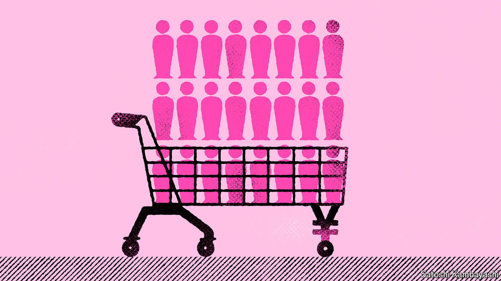

###### Talking shop

# What would get China’s consumers spending? 

##### Clues from a grocer in a fourth-tier city 

 

> May 9th 2024 

On a regular Tuesday morning, a large crowd has gathered outside a grocery store in Xuchang, a city of 4m people. Visit Pangdonglai at the weekend and things are even busier. Thousands, some having travelled hundreds of kilometres, arrive before dawn to take their place in a queue that snakes back and forth in front of the store’s entrance. At a time when China’s ritziest shopping centres are often desolate, and the country’s economy is struggling, the success of Pangdonglai’s 13 outlets is captivating executives who want to understand consumer sentiment.

The latest economic data make the queues still more intriguing. Retail spending grew by just 3.1% in March year on year—well below expectations. In the same month, listed retail firms revised down their expected earnings by an average of 7%. In Shanghai, where per-person consumer spending is three times higher than in Pangdonglai’s home province, high-end grocers are closing down. One such chain, CityShop, announced in April that it would shut its doors for good after 29 years. Pangdonglai’s success contains lessons about both what may be needed to revive China’s economy and the shape that such a revival might take.

