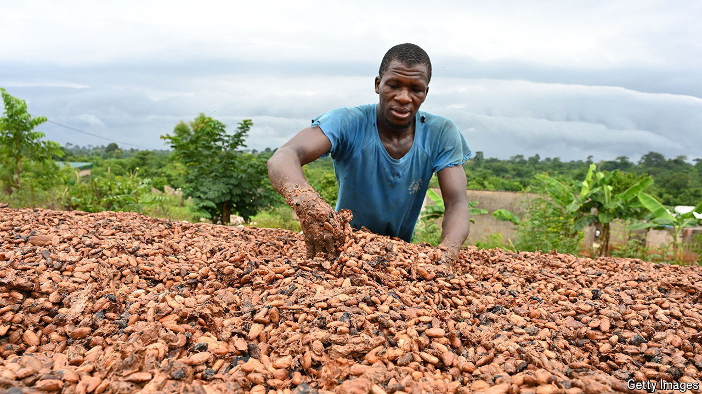
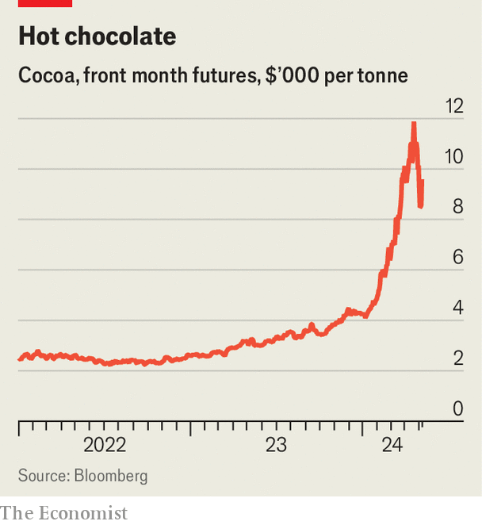

###### Hot chocolate

# Why the global cocoa market is melting down 

##### Toblerones could soon become luxury goods 

 

> May 9th 2024 

BARRY CALLEBAUT, the world’s largest maker of bulk chocolate, is full of beans. Its share price has jumped by 20% since April, when it reported higher sales volumes despite a steep rise in the cost of cocoa. Peter Feld, its boss, told investors not to worry about expensive ingredients: “What goes up fast comes down fast.” 

 


