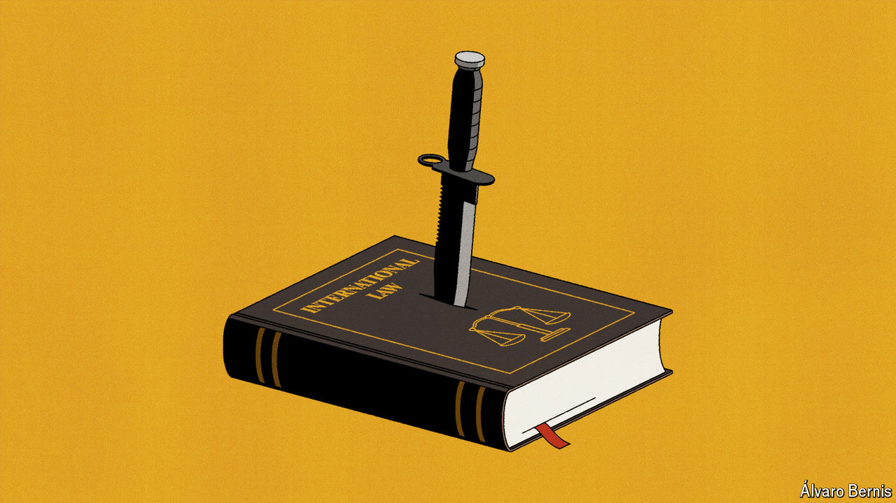

###### International law and disorder

# The world’s rules-based order is cracking 

##### Human-rights lawyers are trying to save laws meant to tame violent rulers 

 

> May 9th 2024 

RARELY HAVE international courts been busier. In The Hague, the International Criminal Court (ICC) is considering war-crimes prosecutions against Israeli leaders, including Binyamin Netanyahu, the prime minister, over the conflict in Gaza. It has already issued an arrest warrant for Vladimir Putin, Russia’s president, for war crimes in Ukraine. The International Court of Justice (ICJ), also in The Hague, is weighing genocide charges against Israel. In Strasbourg the European Court of Human Rights will hear a request in June for Russia to pay compensation to Ukraine.

And yet, for all the legal action, rarely have activists seemed gloomier about holding rulers to account for heinous acts. “We are at the gates of hell,” says Agnès Callamard, head of Amnesty International. Countries are destroying international law, built over more than seven decades, in service of “the higher god of military necessity, or geostrategic domination”.

