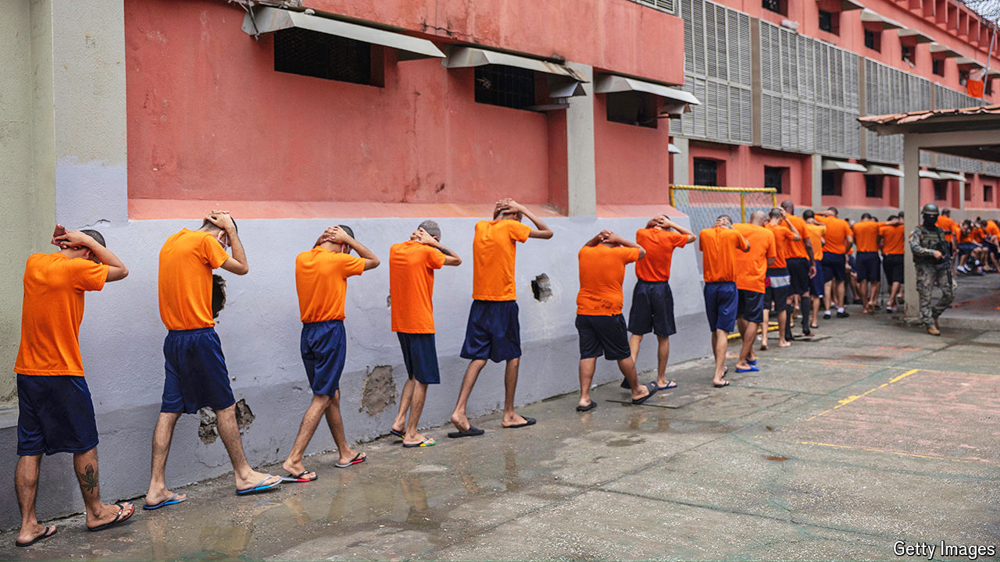

###### Crime and punishment

# How to pacify the world’s most violent region 

##### The iron-fist approach will not solve Latin America’s gang-violence problem 

 

> May 8th 2024 

Durán in ECUADOR is one of the most dangerous cities in the world. Its murder rate of 148 per 100,000 residents in 2023 was almost 50% higher than the next most violent place, Mandela Bay in South Africa. Poor, and with about 300,000 inhabitants, Durán lies across the river from Guayaquil, one of the most important export hubs for cocaine. It is the  of a scourge that has brought misery to Latin America. Despite being home to just 8% of the world’s population, the region accounts for a third of its murders.

To deal with the violence, Latin American leaders often resort to, the iron fist. They impose states of emergency, which may last indefinitely; they send the army into the streets; they carry out indiscriminate mass arrests.  has been championed by El Salvador’s president, Nayib Bukele, who has locked up almost 80,000 people—over 1% of the population—in the past two years. The murder rate has plunged. Officials from across the region praise and seek to copy what they call the “Bukele model”. They shouldn’t.

