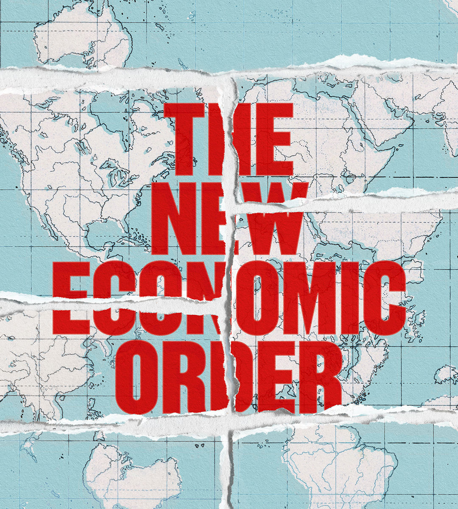

###### The new economic order

# The liberal international order is slowly coming apart 

##### Its collapse could be sudden and irreversible 

 

> May 9th 2024 

At first glance, the world economy looks reassuringly resilient. America has boomed even as its trade war with China has escalated. Germany has withstood the loss of Russian gas supplies without suffering an economic disaster. War in the Middle East has brought no oil shock. Missile-firing Houthi rebels have barely touched the global flow of goods. As a share of global GDP, trade has bounced back from the pandemic and is forecast to grow healthily this year.

Look deeper, though, and you see fragility. For years the order that has governed the global economy since the second world war has been eroded. Today it is close to collapse. A worrying number of triggers could set off a descent into anarchy, where might is right and war is once again the resort of great powers. Even if it never comes to conflict, the effect on the economy of a breakdown in norms could be fast and brutal. 

