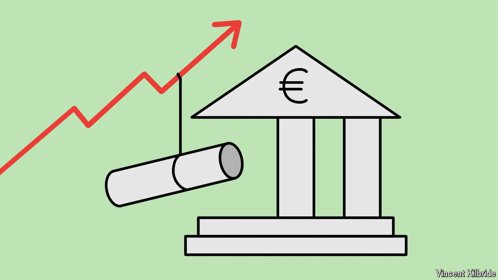

###### Risks and rewards

# Threats to Europe’s economy are mounting. Finance can help fortify it 

##### Time to press ahead with banking and capital-market reforms 

 

> May 9th 2024 

A sense of disquiet is sweeping over the old continent. Innovative, low-cost Chinese producers are taking on Europe’s venerable industries and unsettling its policymakers. Europe has played only a bit-part in the tech revolution: the market value of America’s “magnificent seven” tech giants is about the same as that of the combined stockmarket capitalisation of the eu’s 27 members. In an interview with us last week, President Emmanuel Macron offered his own diagnosis. There can be no great power without economic prosperity and technological sovereignty, but “Europe does not produce enough wealth per capita.” It must become an attractive place to invest and innovate. This requires vast amounts of capital—and a well-oiled financial system that channels savings to promising investment opportunities across the continent. 

The trouble is that European finance remains inefficient and bound by national borders. Pressing ahead with banking and capital-market reforms is thus more important than ever. 

