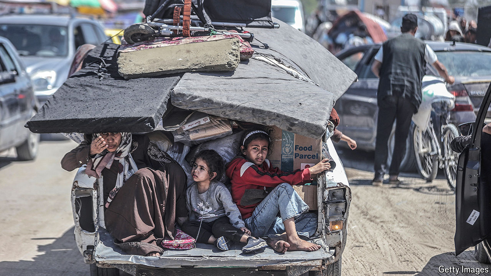

###### Running in place

# After a dramatic week in Gaza, where does the war stand? 

##### The Rafah offensive has not really begun, and a ceasefire is probably still weeks away at best 

 

> May 9th 2024 

FOR MONTHS diplomats in the Middle East have obsessed over two issues. One is the stop-start effort to broker a ceasefire between Israel and Hamas, which would see the group release some of its hostages. The other is the long-threatened Israeli offensive in Rafah, the southernmost city in Gaza, now home to 1.5m people displaced from elsewhere in the enclave. It was a stark choice: either a deal to pause the war or an offensive to widen it.

Then both seemed to happen at once. On May 6th the Israeli army dropped leaflets on Rafah urging about 100,000 civilians to evacuate the city’s south-east. Panicked residents gathered belongings and fled. Later that evening, though, Hamas unexpectedly announced that it had agreed to a proposed ceasefire. Gazans thought their seven-month ordeal was at an end, but that hope was premature. Hours later, amid heavy air strikes, Israeli tanks rumbled into Rafah’s periphery.

