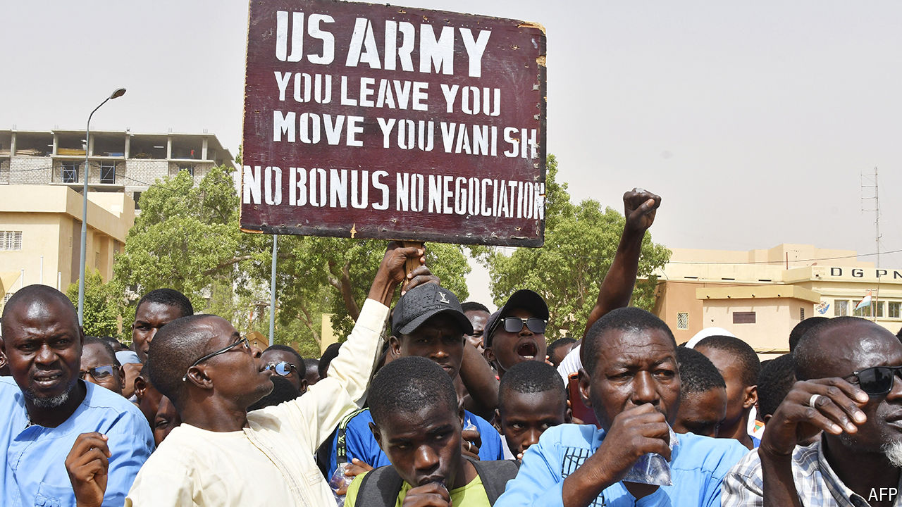

###### An uphill struggle

# Under Joe Biden, America struggles to reassert itself in Africa 

##### As Chinese and Russian influence rise, the odds are against it 

 

> May 9th 2024 

Judging by events in the Sahel over the past few years, America’s standing in Africa has taken a severe knock. It has patently failed to stop the spread of coups across a belt stretching from Guinea in the west to Sudan in east, all now run by military men. American efforts to nudge Sudan from military dictatorship to democracy have ended in a bloody civil war. Last year Niger’s generals told America to close down its base, from which it provided intelligence in the war against jihadists linked to Islamic State and al-Qaeda. 

After the coup there an American delegation led by Molly Phee, the state department’s hapless Africa chief, was given short shrift by the generals. “It was a humiliation,” says an American expert on the Sahel. Worse was to come early this month, when the commander of US Africa Command said America would have to withdraw most of its smaller force from Chad “as part of an ongoing review of our security co-operation”. 

