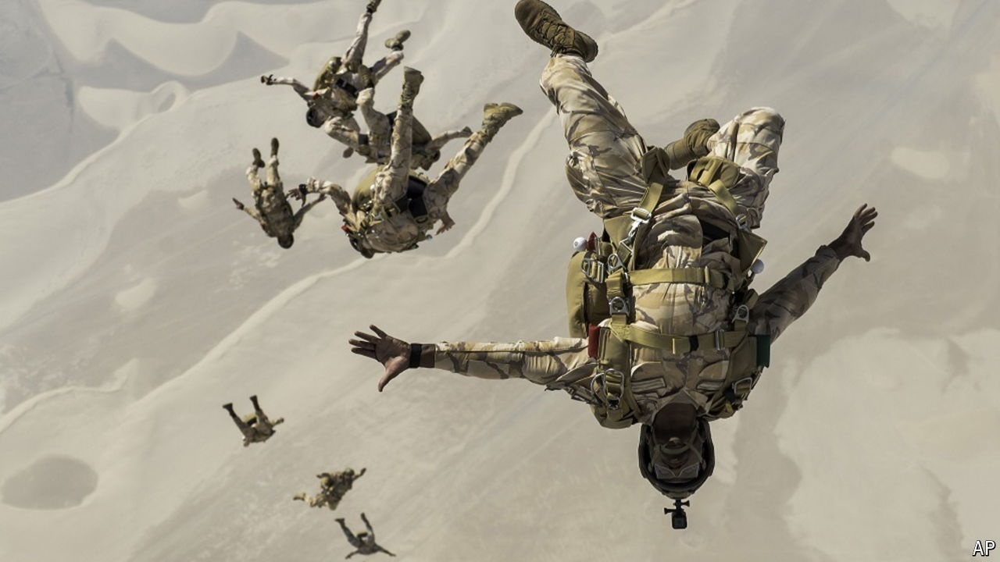
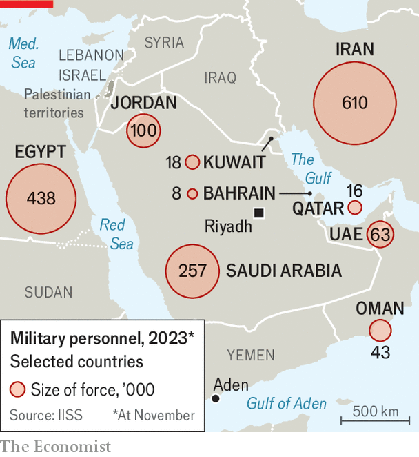

###### Land of lousy armies

# Why are Arab armed forces so ineffective? 

##### Governments are splashing the cash, but that may do little to burnish their armies’ reputations 

 

> May 5th 2024 

WHEN ARAB air-defence crews helped fend off  in April, they drew much praise. And yet Arab states are not usually lauded for their martial prowess; many have lousy military reputations. They have been repeatedly humiliated in wars with Israel. They proved ineffective during the 1991 Gulf war; Egypt deployed two armoured divisions but America quickly sidelined them when they struggled to overcome even limited Iraqi resistance. Other Gulf countries, such as Saudi Arabia, provided only a handful of troops. More recently, despite considerable American military support, the Saudi-led intervention in Yemen descended into a quagmire.

 


