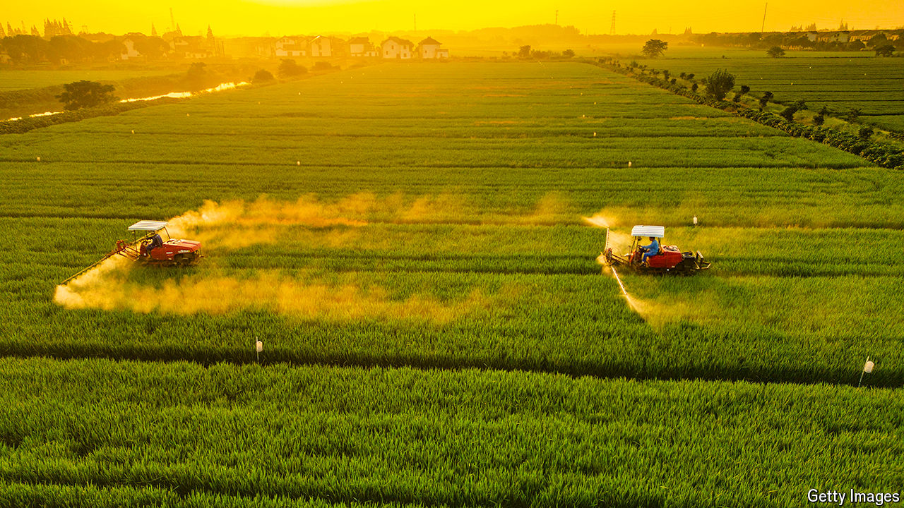

###### AI on the farm

# New crop-spraying technologies are more efficient than ever 

##### Pesticide use could be cut by up to 90% 

 

> May 8th 2024 

The world is awash in pesticides. Fully 3m tonnes are thought to be sprayed onto crops worldwide every year, of which only a small fraction are needed. The excess chemicals are known to run off onto increasingly fragile land and seep into watercourses, with damaging environmental and health effects. The use of agrochemicals continues to grow: global sales of pesticides rose to $79bn in 2022, according to S&amp;P Global Commodity Insights, part of a big research group. That trend could change. A number of new spraying methods employing artificial intelligence (AI) are being commercialised, promising to cut the amount of pesticides a farmer needs to spray by a colossal 90%.

The agricultural industry has already made some progress in reducing overspray. A variety of different additives, called adjuvants, can be mixed into the chemical tank of a sprayer. These adjuvants do not contain any active spray ingredients but consist of other chemicals, such as surfactants, emulsifiers and oils, which can improve the ability of a spray to remain on and penetrate leaves. Some crop sprayers are also fitted with systems borrowed from the paint-spraying processes used in car factories. These create an electrostatic charge on droplets to enhance the way they stick to foliage, although some farmers think it works better on cars than plants.

