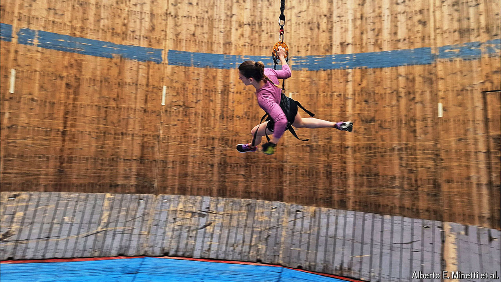

###### Lunar living

# To stay fit, future Moon-dwellers will need special workouts 

##### Running around the inside of a barrel might help 

 

> May 8th 2024 

MOTORCYCLISTS SEEKING to cement their reputation as daredevils could do worse than book a session on a Wall of Death. These are small circular velodromes where the track, instead of being lightly raked, is completely vertical. Viewed from above, the effect is of riders zooming around the inside of a washing machine.

What drives these brave souls up the wall is their speed. At around 50kph, the forces acting on them are strong enough to counterbalance gravity’s pull, and keep them pushed outward.

