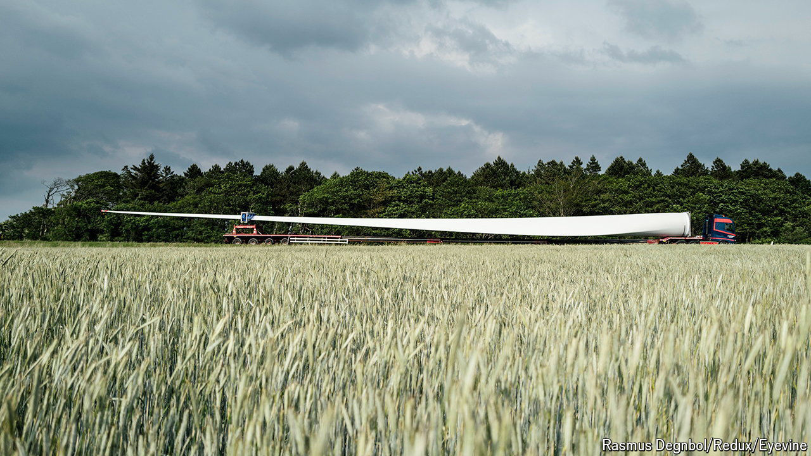

###### Blade runners

# Wind turbines keep getting bigger 

##### That poses a giant transport problem 

 

> May 8th 2024 

IN RECENT YEARS the manufacture of blades for wind turbines has undergone a revolution, as it were. Two decades ago lengths of 40 metres or so were an achievement. Thanks largely to lighter and stronger carbon-fibre composites, the state of the art is now triple that. As turbine output is proportional to the square of blade length, this has also increased how much power can be produced. The biggest turbines in 2004 could generate about two megawatts. Today’s giants can exceed 15.

But there’s a hitch. Today’s longest blades have become too big to be delivered to inland wind farms. They can be taken only by ship to offshore sites, where building costs are far higher. 

