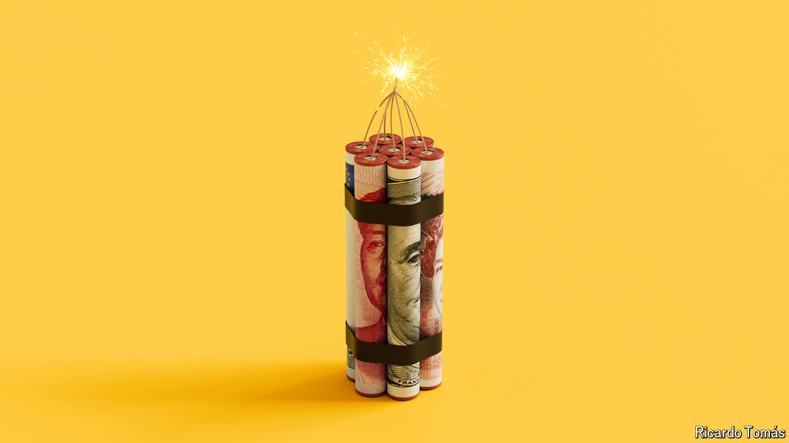

###### Future shock

# How the financial system would respond to a superpower war 

##### A conflict could deal a death blow to the global financial order 

 

> May 3rd 2024 

The idea that economic integration can safeguard peace is old, intuitive and spectacularly wrong. In a popular book of 1910, the economist Norman Angell argued that great-power conflict was irrational, since “the complexity of modern finance makes New York dependent on London, London upon Paris, Paris upon Berlin, to a greater degree than has ever yet been the case in history.” A century later, similar wishful thinking in western Europe fostered the building of Nord Stream 2, a gas pipeline from Russia to Germany. In a globalised world, war has no winners. But that did not stop Europe from digging trenches in 1914, nor Russian troops from storming Ukraine in 2022.

It is tempting to conclude that the fragmentation described in this special report—of capital flows, payment networks and financial institutions—might be spurred by geopolitics, but has little bearing on it in return. A single, globalised financial system is neither necessary nor sufficient for peace. As they chip away at it, officials from Washington to Beijing might regret the opportunities and connections being lost. They need not worry they are hastening Armageddon.

