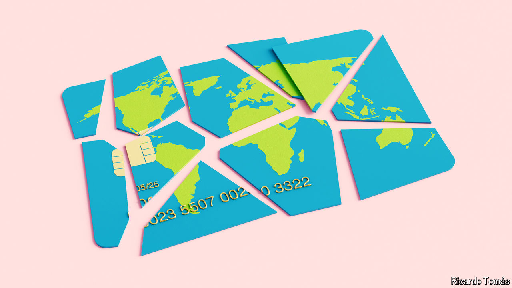
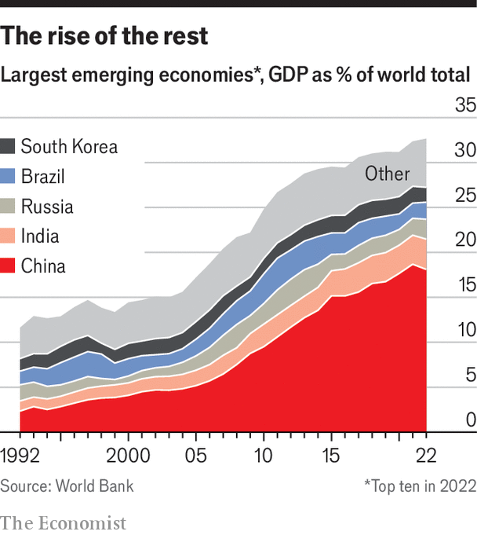

###### Worlds apart

# The global financial system is in danger of fragmenting 

##### The American-led financial order is giving way to a more divided one 

 

> May 3rd 2024 

Ten years ago your correspondent was fidgeting nervously in a meeting room at VTB Capital, the investment-banking arm of Russia’s second-biggest bank, just across the road from the Bank of England. During the recruitment process for a graduate job, things had taken a worrying turn. A Russian missile had shot down MH17, a passenger flight from Amsterdam to Kuala Lumpur, while it was passing over Ukraine. Plenty of Russian firms were already under Western sanctions owing to the annexation of Crimea earlier that year. Now sanctions were being ramped up, and VTB Capital’s parent bank was a prime target. Hence the fidgeting: how to ask the slightly alarming man across the table whether there would even be a VTB in a few months’ time?

 


