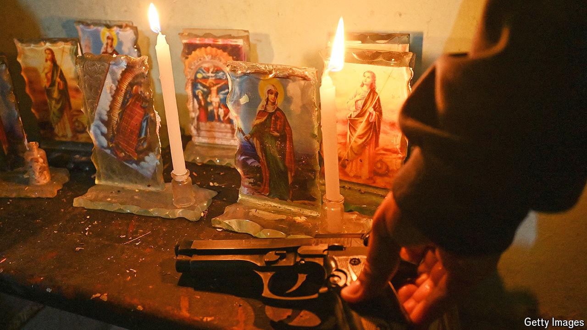

###### When gangs rule

# Rural Colombia welcomes gangs that mete out vigilante justice 

##### Using grisly methods, the gangs enforce social conservatism 

 

> May 9th 2024 

María Álvarez (not her real name) is a devout Catholic. She was relieved last year when the Ismael Ruiz gang, an offshoot of the Revolutionary Armed Forces of Colombia (FARC), set up operations in her rural home town of San Antonio. They promised to end what Ms Álvarez calls “immoral behaviours”. Then, two months ago, the gang ran her son out of town. They disliked his motorcycle stunts, long hair and earrings. She misses him, but maintains that “social cleansing prevents people from stealing from hard-working people like us, and it helps to make sure our young people behave.”

Most Latin Americans abhor the scourge of organised crime and support harsh crackdowns. This accounts for the remarkable popularity of Nayib Bukele, El Salvador’s president, who has used mass incarceration and the army to bring what had been one of the world’s highest murder rates down to near that of Canada. But there are pockets of Latin America, particularly in rural areas, where gangs have become popular and act as the de facto state. Some 14% of Latin Americans (80m people) say criminal groups provide order and reduce crime in their communities.

