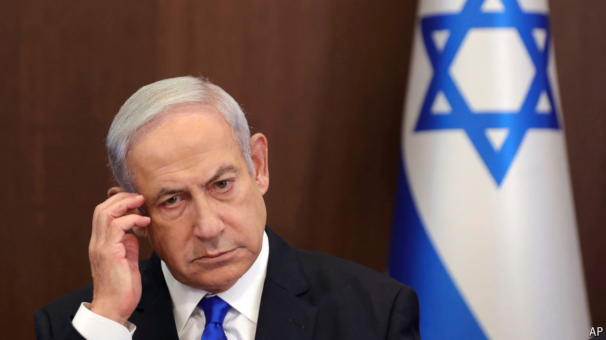

###### The Economist explains

# Could the International Criminal Court indict Binyamin Netanyahu? 

##### Rumours abound that an arrest warrant is imminent for Israel’s prime minister 

 

> May 7th 2024 

Israel’s government is concerned that the International Criminal Court (ICC) in The Hague will issue arrest warrants against senior Israeli officials in relation to the war in Gaza. Those under suspicion could include , Israel’s prime minister, members of his cabinet and generals in the Israel Defence Forces. The ICC has not said it is considering such a move. Yet Mr Netanyahu felt the threat serious enough to state on April 30th that any warrant “would be an outrage of historic proportions”. The ICC’s chief prosecutor, Karim Khan, warned that threats to “retaliate” against the court could undermine its impartiality. On what grounds would the ICC issue such warrants, and what would be the consequences? 

Several accusations of war crimes have been made against Israel during the war. The International Court of Justice, for instance, which is not connected to the ICC, has conducted  on whether Israel is carrying out a genocide in Gaza. Unlike that court, the ICC deals with individuals rather than countries. 

