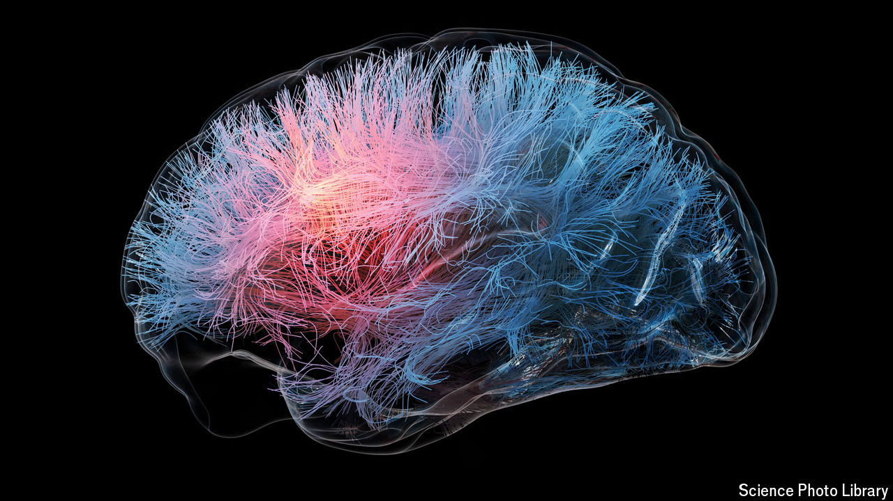

###### The Economist reads

# These books reveal why the brain is the biggest mystery of all 

##### Eight of the best books on brains and consciousness—human, octopus and other 

 

> May 3rd 2024 

THE HUMAN brain—the enigmatic organ of thought—is the most intricate object in the universe, a tangled orchestra of hundreds of billions of cells generating precise electrical impulses that make up a mental symphony. Understanding how these harmonies conjure thoughts, memories and emotions is perhaps the greatest scientific question of all—the brain seeking to understand itself—and yet the question remains unanswered after 150 years of investigation by many of the best brains. Fortunately, they have made some progress. These books elegantly summarise what is (and is yet to be) known about brains.

By Larry Swanson, Eric Newman, Alfonso Araque and Janet Dubinsky. 

