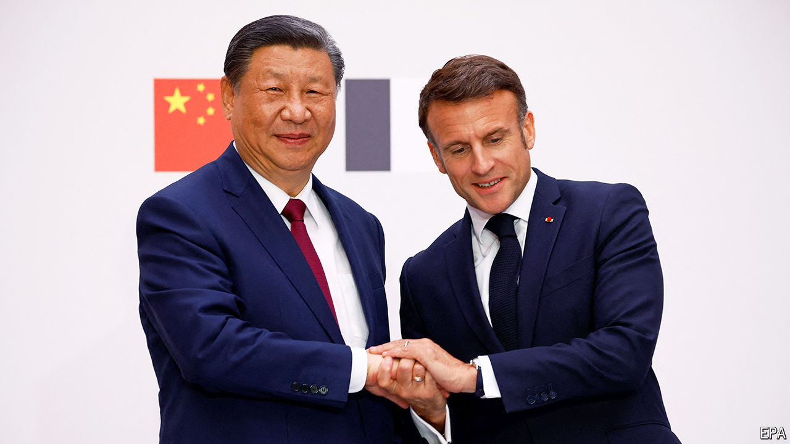

###### The world this week

# Politics 

#####  

 

> May 9th 2024 

For the first time in five years, . China’s leader was welcomed by his French counterpart, Emmanuel Macron, who pressed him to help end the war in Ukraine and to establish a more balanced trade relationship. Mr Xi gave little ground. He then moved on to Serbia, where he commemorated the 25th anniversary of America’s bombing of the Chinese embassy in Belgrade. “This we should never forget,” he wrote in a piece for a Serbian newspaper. Mr Xi wrapped up his tour in Hungary, a member of the EU and NATO that is also a staunch supporter of China. Mr Xi praised its “independent” foreign policy.

 carried out  in southern  and told 100,000 civilians to leave because it was planning to “operate” there. It took control of part of the Philadelphi corridor, a strip of land next to Egypt, as well as the Rafah crossing on the border with Egypt. Joe Biden said he would not supply Israel with the weapons that would be used in an attack on Rafah. Meanwhile, Israel temporarily closed Kerem Shalom, a commercial crossing into Gaza through which most humanitarian aid enters the strip, after four soldiers were killed in a rocket attack by Hamas. 

