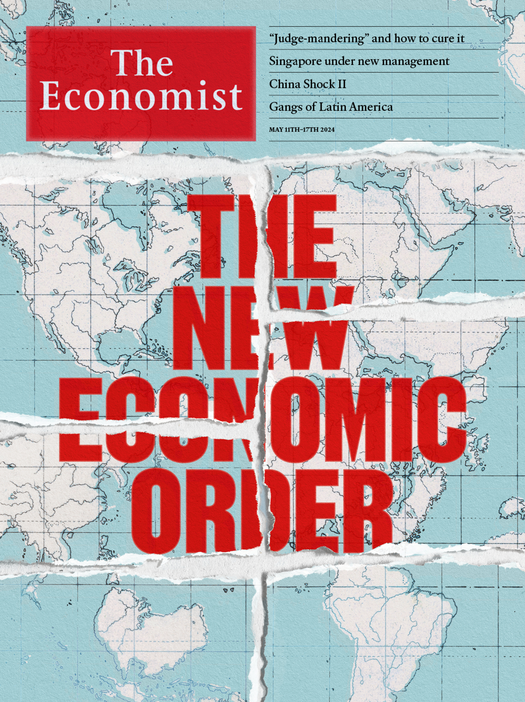

###### The Economist

# This week’s covers 

##### How we saw the world 

> May 9th 2024 

WE HAD TWO covers this week. In most of the world we shared our thoughts on the fracturing of the liberal international order. At first glance, the world economy looks reassuringly resilient. But a deeper look reveals fragility. For years the order that has governed the global economy since the second world war has been eroded. Today it is close to collapse. A worrying number of triggers could set off a descent into anarchy, where might is right and war is once again the resort of great powers. Even if it never comes to conflict, the effect on the economy of a breakdown in norms could be fast and brutal.

 


