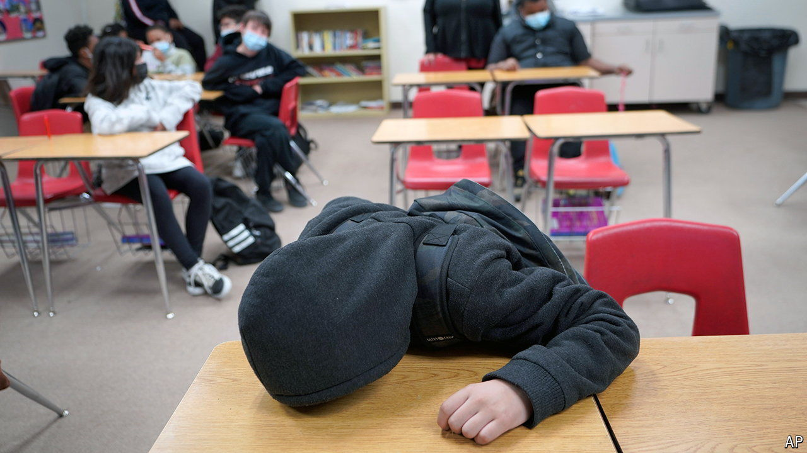

###### Absent no more

# American pupils have missed too much school since the pandemic 

##### But clever policies have got some truant children back in the classroom 

 

> May 9th 2024 

Many families with children were clamouring to get back to in-person learning during the covid-19 pandemic. But many pupils were less eager to do so, and some still have yet to properly return. Thousands of children disappeared from the rolls. Fortunately, a few schools seem to have worked out how to coax some of their pupils back to their desks.

Absenteeism was a problem long before covid, but the disruption made things far worse. According to a study from Stanford University, more than a quarter of all American pupils in the 2021-22 school year missed at least three and a half weeks of school—almost double the pre-pandemic rate. Every one of the 40 states in the study saw an increase in absenteeism after 2018-19, the last full academic year before the pandemic. The worst rates, and some of the biggest rises, were in Alaska and New Mexico (while Alabama and New Jersey were best in class). 

