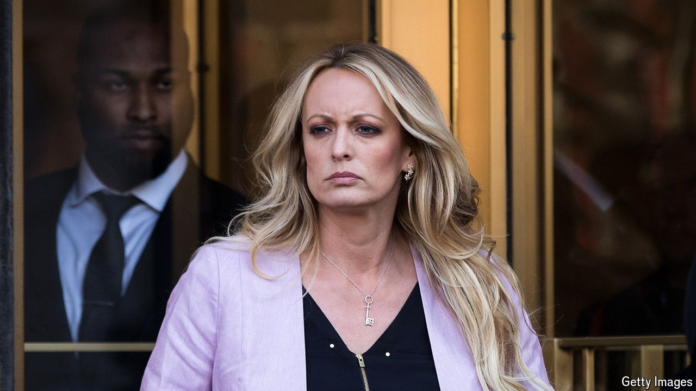

###### Waiting to climax

# Plenty of circumstantial evidence at Donald Trump’s trial 

##### But prosecutors will need Michael Cohen to seal the deal 

 

> May 8th 2024 

Donald Trump’s criminal trial, soon to enter its fifth week, has felt like drawn-out foreplay. There have been moments of frisson. But as with any such encounter that stretches on and on, arousal waxes and wanes, prompting a few fateful questions. Where is this going? Hurry it up already? Ultimately, climax in this trial will depend on the testimony of one man: Michael Cohen, Mr Trump’s former lawyer. And he is not due on the witness stand for several days yet. 

Instead this week jurors heard from Stormy Daniels, a former porn star and current host of the gay-dating show “For the Love of DILFs”. The felony charges against Mr Trump stem from a payment that Mr Cohen made to Ms Daniels before the 2016 presidential election, to keep her story of sex with the then candidate out of the press. Her description of that encounter in 2006—which Mr Trump denies—was salacious. There was talk of spanking and missionary position. The defence tried to paint her as a money-grubbing extortionist, to which she replied matter-of-factly: “Don’t we all want to make more money in our jobs?”

