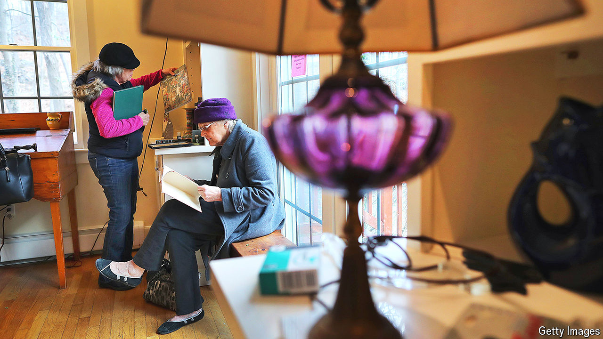

###### Good stuff

# Why online marketplaces have not killed the estate sale 

##### Is it easier to get people to buy old junk in person? 

 

> May 7th 2024 

In a house on a cul-de-sac in Arlington Heights, a nondescript suburb of modest 1950s homes north-west of Chicago, Deborah Fossett is counting hundred-dollar bills. Holding each one up to the light, she examines nine in total. Satisfied, she writes out a receipt, and hands it to the customer, who picks up his purchase—an antique set of silver Tiffany cutlery. Similar sets online sell for thousands of dollars, she tells him. But this one is missing several pieces, and in any case, everything in the house must go, and it is past two o’clock, so $900 is enough. He eyes his bargain again and quickly leaves.

Ms Fossett runs Chicago Estate Advisors, a firm which will sell everything in your house for you. Typically the clients are the relatives of recently deceased former occupants, though sometimes they are people who are merely downsizing or decluttering. Almost all of this activity happens in person, offline. Most of the firms doing it are small, like Ms Fossett’s. 

