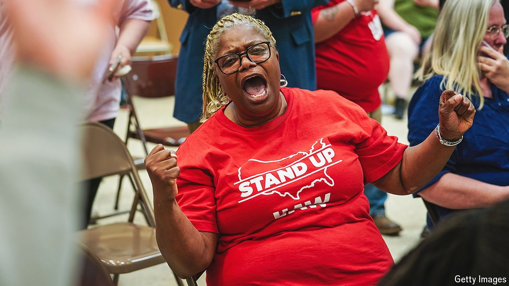

###### Labour pains

# Will unions sweep the American South? 

##### The UAW won big at Volkswagen in Tennessee, but organising at other car plants is harder 

 

> May 9th 2024 

Last July car parts as heavy as a small horse fell on Renee Berry. Three surgeries later she has metal rods, bolts and screws up her arms and cannot lift her two-year-old grandchild. In her 14 years working on the assembly line at the Volkswagen plant in Chattanooga, Tennessee, she found the factory floor to be disorganised and unsafe. Eventually she joined a union drive to persuade her colleagues to take action. When workers voted in late April to make Volkswagen the first foreign carmaker in the South to unionise, Ms Berry fell to the floor in joy, raised her hands and called out: “Thank you, Lord, you heard our cry.” 

The United Auto Workers (UAW) union hopes that the Volkswagen victory will set off a domino effect across the sunbelt, a region that has long been hostile to labour organisers. But was the win a fluke or a bellwether? That question will soon be tested: next week 6,100 workers at the Mercedes-Benz plant in Vance, Alabama, are due to vote on whether to unionise. There, things look less favourable for the UAW.

