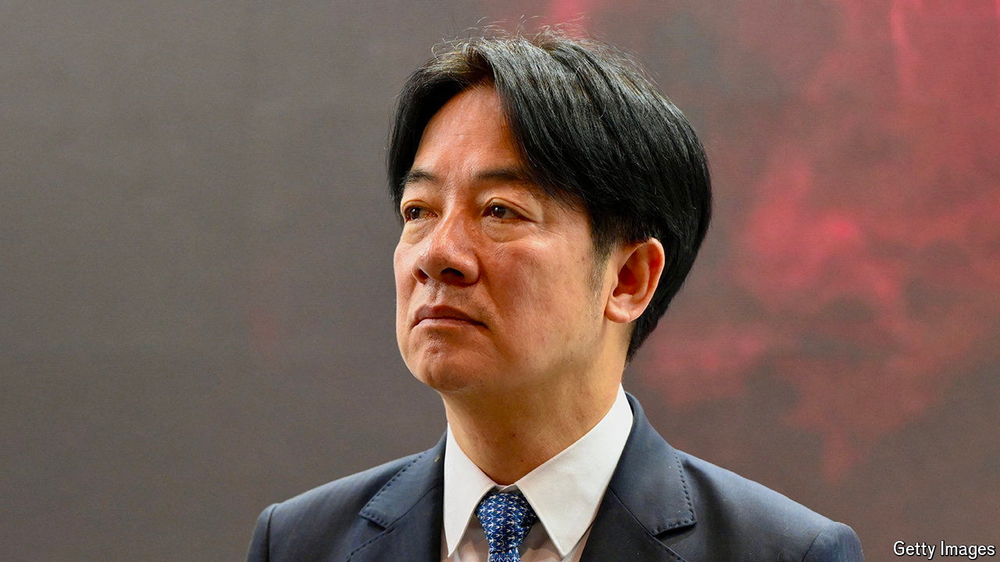

###### Self help

# Taiwan wants to prove that it is serious about defence 

##### Its incoming president, Lai Ching-te, will face new challenges 

 

> May 16th 2024 

THE LESSON drawn from Russia’s invasion of Ukraine is obvious to Taiwanese officials: if you want the world to help in your struggle against an overbearing neighbour, you must first fight back fiercely yourselves. Taiwan’s outgoing president, Tsai Ing-wen, has long seemed to understand as much. She has overhauled the island’s approach to defence since coming to office in 2016.

Back then, Taiwan’s defence spending had stagnated for nearly two decades and conscription was only four months long. By contrast China’s defence budget had grown by about 10% every year from 2000 to 2016. It had developed missiles capable of striking American bases in Guam. By 2020 its navy was the largest in the world. Even so, Taiwan’s defence strategy involved preparing to take on China directly. No longer. 

