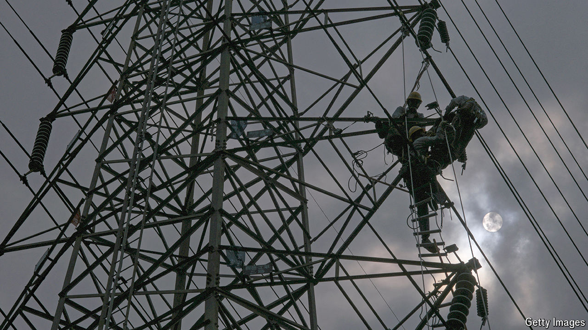

###### A fragile grid

# Taiwan, the world’s chipmaker, faces an energy crunch 

##### The island is already plagued by blackouts 

 

> May 16th 2024 

Lai Ching-te, who will take office as Taiwan’s president on May 20th, has ambitious plans for the island’s energy mix. He wants to push the proportion of renewable electricity production to 30% by 2030, up from 11% today. He also has plans to achieve net-zero carbon emissions by 2050. But some doubt he can fulfil these promises. Blackouts have been plaguing the island. Can Taiwan, the source of over 60% of the world’s advanced semiconductors, avoid an energy crunch?

Upon taking office in 2016 Tsai Ing-wen, Taiwan’s outgoing president, vowed to simultaneously reduce carbon emissions and phase out carbon-free nuclear energy, which then stood at 12% of the mix (it now accounts for less than 7% of electricity generated). Ms Tsai and Mr Lai belong to a party that is avowedly anti-nuclear. While this task made ideological sense, it has turned out to be a struggle. Liang Chi-yuan at Taiwan’s National Central University estimates that only a quarter of planned windpower projects were on schedule between 2017 and 2022. 

