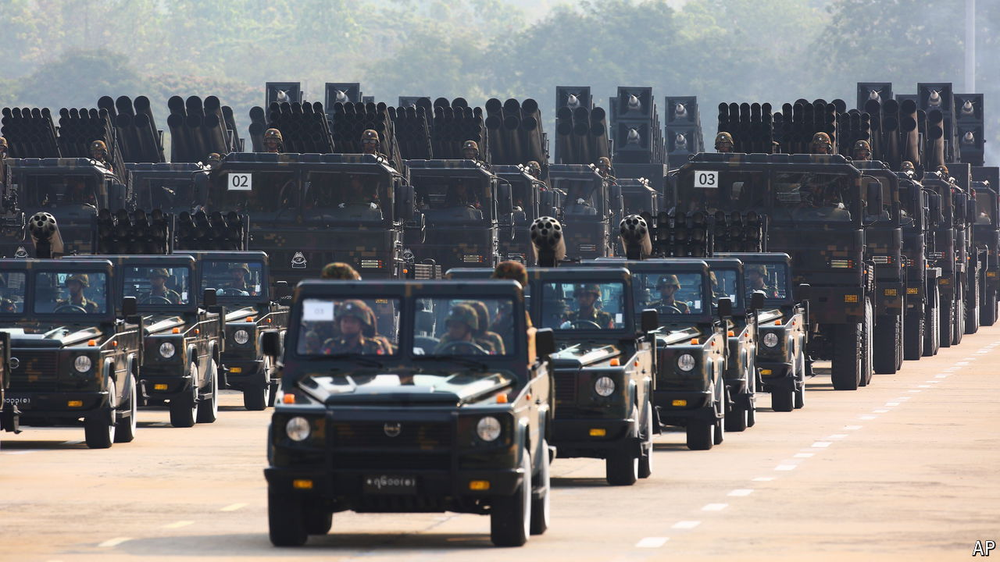
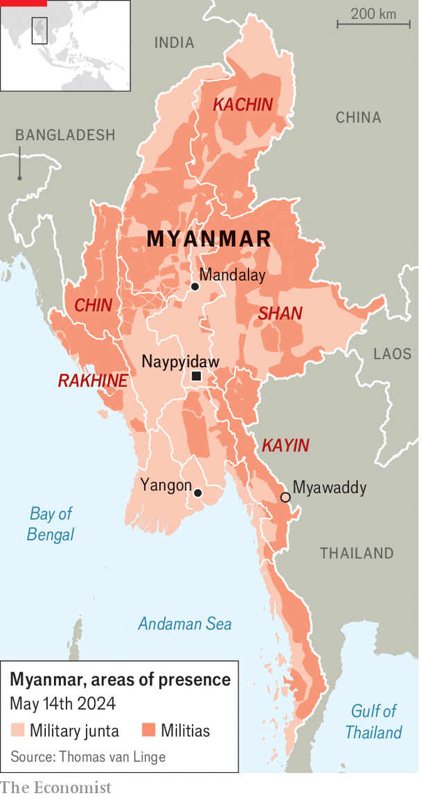

###### A brutal civil war

# The military dictatorship controls less than 50% of Myanmar 

##### The junta has suffered severe losses but remains powerful 

 

> May 16th 2024 

Ever since Myanmar’s military junta seized power in a coup in 2021, hundreds of disparate resistance groups have been fighting back. Since late last year, the opposition has gained ground. The seizure on April 11th of Myawaddy, an important trading town on the border with Thailand, looked like a turning-point. Some analysts predicted that the junta would soon fall. But less than two weeks later, Myawaddy was back in the hands of Saw Chit Thu, a pro-military warlord. What would it take to topple the junta? 

 


