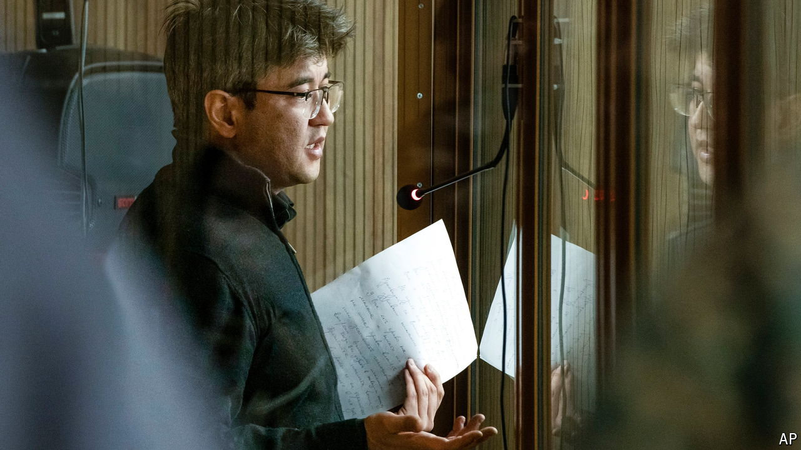

###### Justice in Kazakhstan

# The murder that aroused a nation 

##### Despite a recent conviction, a culture of impunity persists among the well-connected 

 

> May 16th 2024 

IF YOUR PARTNER were lying unconscious after a frenzied assault, you would generally call an ambulance. Not Kuandyk Bishimbayev, a former minister in Kazakhstan. Instead, as his common-law wife lay dying, he phoned a clairvoyant, who assured him (mistakenly) she would be fine. Last year Saltanat Nukenova died of injuries inflicted by Mr Bishimbayev (pictured) in a fancy restaurant owned by his family in the country’s glitzy capital, Astana. On May 13th a court handed him a 24-year prison sentence. Millions of Kazakhs had tuned into the live-streamed trial, which sparked anguished soul-searching over domestic violence—and highlighted the sense of entitlement and impunity among Kazakhstan’s rich and powerful.

Evidence in court included CCTV footage of Mr Bishimbayev punching and kicking Ms Nukenova and dragging her by her hair. The prosecution said he was brutally abusive; the defence portrayed the deceased as an alcoholic who drove him to violence. Kazakh women posted photos of themselves clutching drinks, captioned: “If you see me with a glass of wine, that does not mean you can kill me.” 

