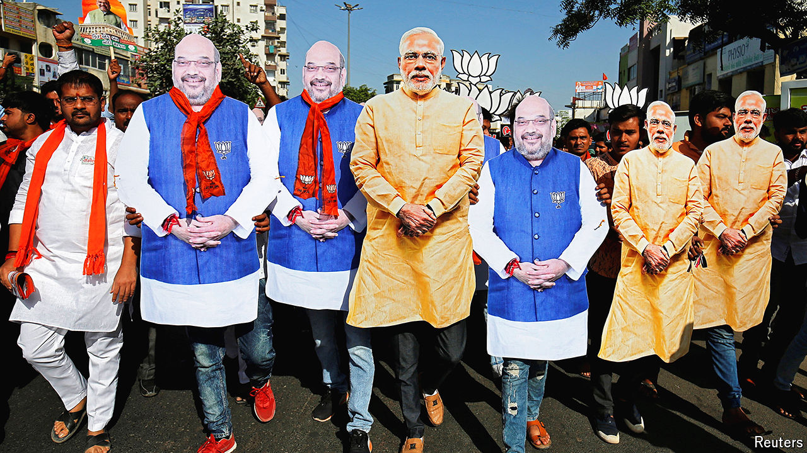

###### Heirs in races

# Who could replace Narendra Modi? 

##### A leadership struggle is brewing in India’s ruling party 

 

> May 13th 2024 

Arvind Kejriwal left prison determined to make up for lost time. Delhi’s chief minister, who also leads an opposition party, had  on corruption charges that he says were politically motivated. Released on interim bail on May 10th, midway through a six-week , he denounced the prime minister, Narendra Modi, as a “dictator” at a news conference the next day. Mr Kejriwal also lobbed an unexpected political grenade, claiming that if the Bharatiya Janata Party (BJP) wins a third consecutive election victory as expected, Mr Modi would step down next year when he hits the party’s unofficial retirement age of 75. 

His replacement, Mr Kejriwal suggested, would be the steely 59-year-old home minister, , who has led the government’s clampdown on political dissent. Mr Shah quickly countered that the BJP’s constitution contained no retirement rule and Mr Modi would serve another full five-year term. Still, the timing was irksome for the Hindu-nationalist party, which has lately hardened its Islamophobic rhetoric following lower-than-expected voter turnout amid whispers of . Mr Kejriwal has touched upon one of the most delicate questions within the BJP: who could replace Mr Modi when he eventually retires?

