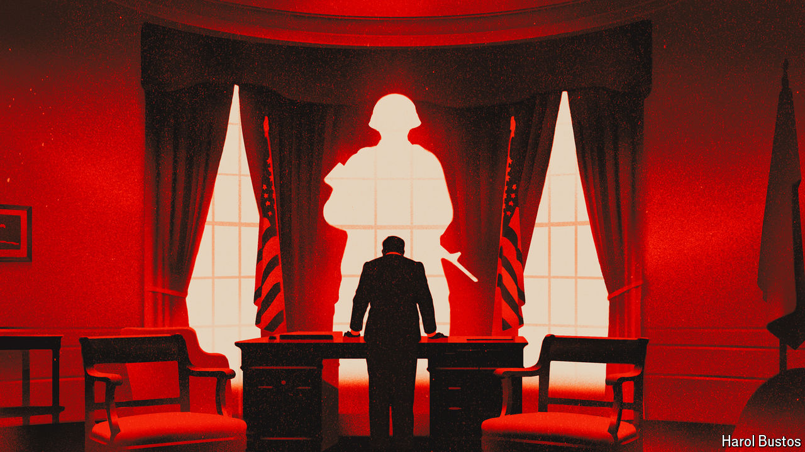

###### In the worst case

# Why America is vulnerable to a despot 

##### Its democratic system is not as robust as it seems 

 

> May 16th 2024 

PRESIDENT OF THE UNITED STATES is a coveted job, at least among a certain type of power-crazed geriatric man. America’s founders nearly made the office more exalted still. John Adams, the first vice-president, thought the president should be known as His Elective Majesty or His Mightiness. The Senate endorsed another form of address: His Highness, the President of the United States and Protector of their Liberties. But the House of Representatives rejected grand titles, and George Washington went along with it to dispel claims that he had monarchical ambitions. The accusations flew anyway, and have been repeated whenever one party dislikes what the president is up to, which is to say most of the time.

Novelists have , imagining the overthrow of American democracy by a charismatic dictator: President Buzz Windrip in Sinclair Lewis’s “It Can’t Happen Here” (1935), Nehemiah Scudder in Robert Heinlein’s sci-fi series “If This Goes On” (1941), Charles Lindbergh in Philip Roth’s “The Plot Against America” (2004). President Scudder, a preacher-turned-politician from the boondocks, wins the election of 2012. The election of 2016 is then cancelled.

