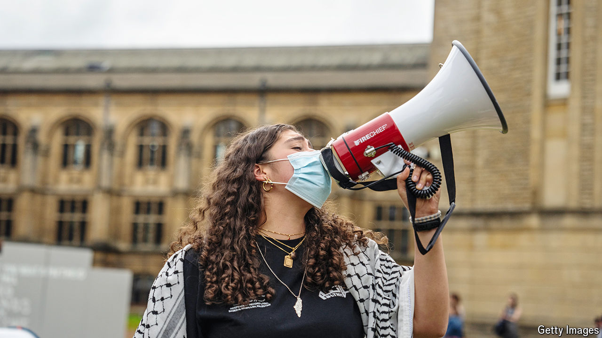

###### Free speech and protest

# Antisemitism is on the rise in Britain 

##### But university encampments show how hard it is to define 

 

> May 16th 2024 

Universities should be bastions of tolerance and respect, Rishi Sunak, the prime minister, told a group of vice-chancellors on May 9th. Inspired by , students at more than a dozen British universities have now pitched “encampments” to protest against Israel’s brutal . A “vocal minority” is causing disruption “and, in some cases propagating outright harassment and antisemitic abuse”. This “had to stop”, said Mr Sunak. 

Neither unrest nor antisemitism were much in evidence at the University of Oxford’s protest camp the following day. Dubbed the “liberated zone”, after an encampment at Columbia University in New York, the collection of tents on the lawn of the Pitts Rivers Museum, which houses the university’s anthropological treasures, had an atmosphere of studious calm. 

