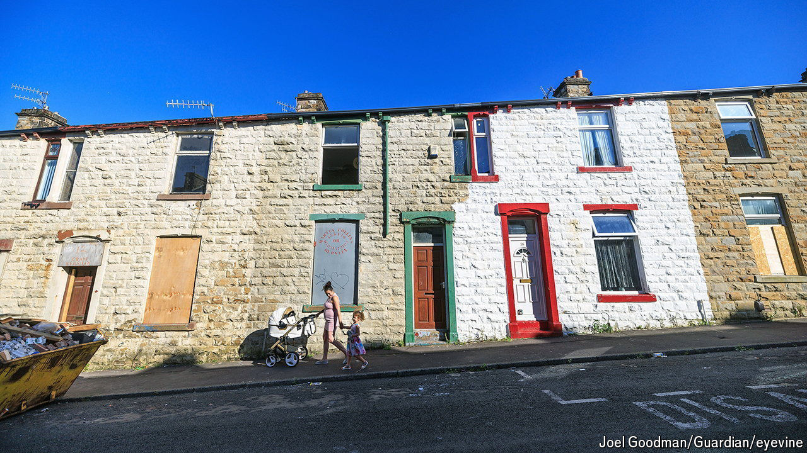

###### Levelling the terrain

# Is Britain levelling up? 

##### Some town centres are getting prettier. Yawning economic gaps remain 

 

> May 13th 2024 

Burnley, an hour’s drive north of Manchester, was once a thriving textiles hub. An imposing town hall recalls its Victorian success. But Burnley’s population is lower today than it was in 1900; wages are a quarter below the national average. The government has designated the area a priority for “levelling up”, its programme to close the wealth divide between the south-east of England and other regions. 

In 2021 Burnley received £20m ($25m) from the first set of levelling-up grants, money intended to finance local regeneration projects. The funds were for refurbishing a derelict mill for university buildings, tidying up the road from the town centre to the football stadium and building a train-station footbridge. The first two projects are due to wrap up soon. 

