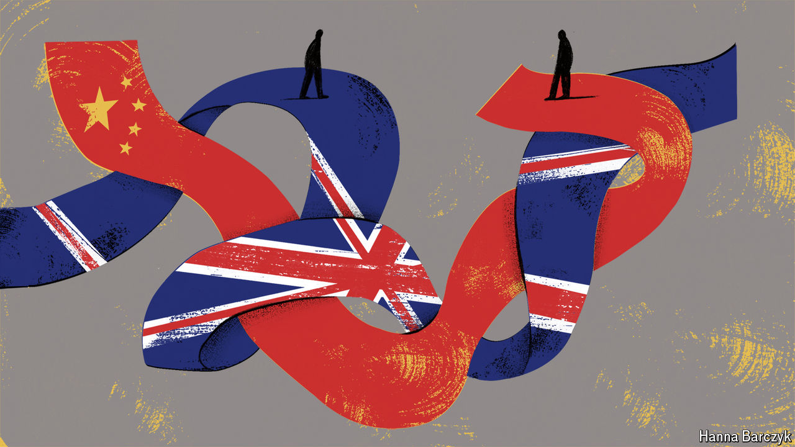

###### A new kind of threat

# Spies, trade and tech: China’s relationship with Britain 

##### China was once seen as a golden opportunity. It is increasingly viewed as a threat 

 

> May 16th 2024 

WHEN JOHN Le Carré joined MI5, Britain’s domestic security service, in the 1950s, long before finding fame as a spy novelist, his first job was not hunting the KGB. He was given the humdrum task of monitoring Commonwealth students in London. Chinese spies were thought to be using ethnically Chinese Singaporean and Malay students to gather industrial intelligence. It was not the most glamorous job. Le Carré was “dismayed”, recalls his biographer, to find that MI5’s China experts were “elderly retired missionaries with an imperfect command of the language”. 

Today, China policy is no longer a backwater in the intelligence world. On May 13th police charged three men, including a former Royal Marine, with aiding the intelligence service of Hong Kong—in practice, controlled from Beijing—and conducting “foreign interference”. The men were charged under the National Security Act, a law passed in July 2023 in part to give British police the powers to investigate and tackle China’s covert activity. (China denies that Hong Kong’s intelligence service was involved.)

