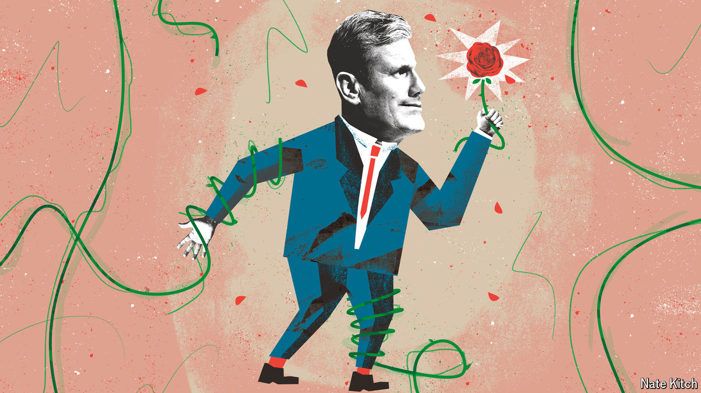

###### Bagehot

# The narcissism of minor differences, Labour Party edition 

##### On the centre-left the small divisions can be the most toxic 

 

> May 15th 2024 

British politics has left an era of consequence and entered a period of consensus. For the past decade Britain has wrestled with immense constitutional questions, which are now largely settled. Under Jeremy Corbyn and Liz Truss, both Labour and the Conservatives experimented with and abandoned radical economic ideas. The parties’ fiscal policies have merged. In an era of low interest rates, spending was limited by political imagination; in an era of high interest rates, spending is dictated by the market. Politics is becoming a narrower contest but a no less nasty one. 

Nowhere is this more apparent than in the Labour Party. Barely five years ago, the party was at war with itself. Moderate mps were in open rebellion against , a left-winger who wanted to hand 10% of every big British firm to workers. A splinter group of centrist mps left the party to form their own. Divisions were wide. 

