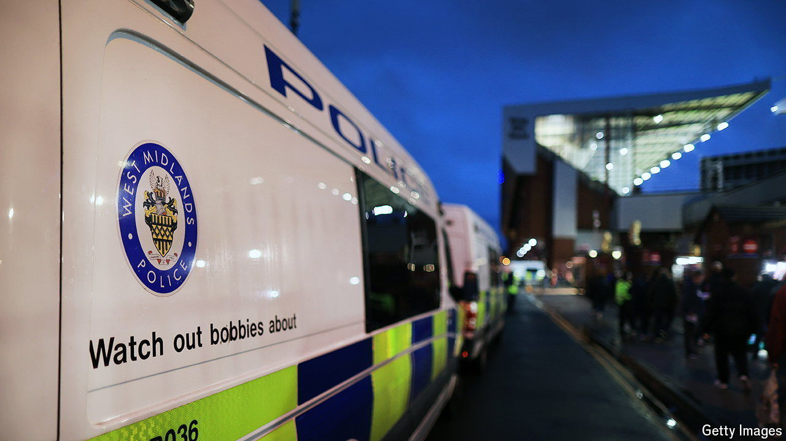

###### Pick your projection

# What police commissioners tell you about the British election 

##### Neither Labour landslide nor hung Parliament 

 

> May 16th 2024 

Political junkies have lots of electoral forecasts to choose from, ‘s included. That gives them a confusing range of possible outcomes to pore over. Some models predict a landslide victory for Labour; Electoral Calculus, a consultancy, reckons that the Tories would scrape fewer than 100 seats if an election were held tomorrow. 

Others reckon things could be far closer. Based on the results of local elections at the start of the month, Colin Rallings and Michael Thrasher, two politics professors, have suggested that the next general election would produce a hung parliament rather than a Labour majority.  sits in between these poles: our central estimate is for a Labour majority of 114. 

